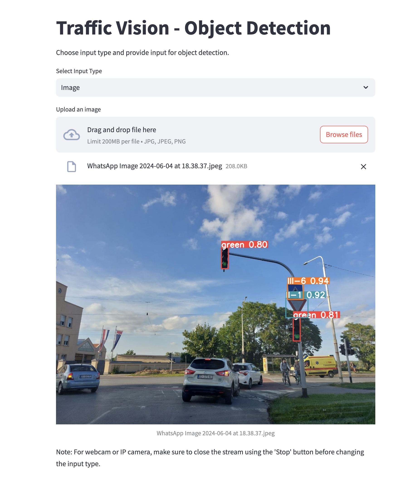

## Traffic Vision - Object Detection Application

This application is designed for detecting traffic signs and traffic lights in images, videos, webcam streams, and IP camera feeds. It uses Streamlit for the user interface and allows users to select various input types for object detection.

### Features
- Detects traffic signs and traffic lights in images, videos, and real-time streams.
- Supports input from uploaded images, multiple images, videos, webcam, and IP camera.
- Logs the speed of the detection process for performance monitoring.

### Requirements
- Python 3.7+
- Streamlit
- OpenCV
- Torch
- NumPy
- PIL (Pillow)

### Installation
1. Clone the repository:
    ```bash
    git clone https://github.com/yourusername/traffic-vision.git
    cd traffic-vision
    ```

2. Install the required packages:
    ```bash
    pip install -r requirements.txt
    ```

3. Ensure you have the model files available in the specified paths:
    - `signs_model_path`
    - `lights_model_path`

### Usage
1. Run the application:
    ```bash
    streamlit run app.py
    ```

2. Open the application in your browser. It will be running at `http://localhost:8501`.

3. Select the input type from the dropdown menu:
    - **Image**: Upload a single image for detection.
    - **Images**: Upload multiple images for detection.
    - **Video**: Upload a video file for detection.
    - **Webcam**: Use your webcam for real-time detection.
    - **IP Camera**: Provide an IP camera address for real-time detection.

4. Follow the on-screen instructions to upload your files or start the stream.
5. 
### Image Interface


### Instructions for Developers

- Modify the paths to your model files in the `vision_model` initialization.
- Ensure that the necessary model files are downloaded and placed in the correct directories.
- Use the logged speed data to monitor and optimize the performance of your model.
- For any issues or contributions, please open an issue or submit a pull request on the GitHub repository.

Happy Coding! 🚀

